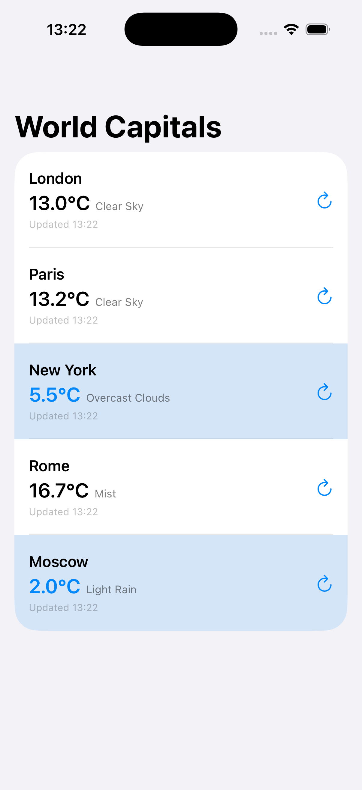
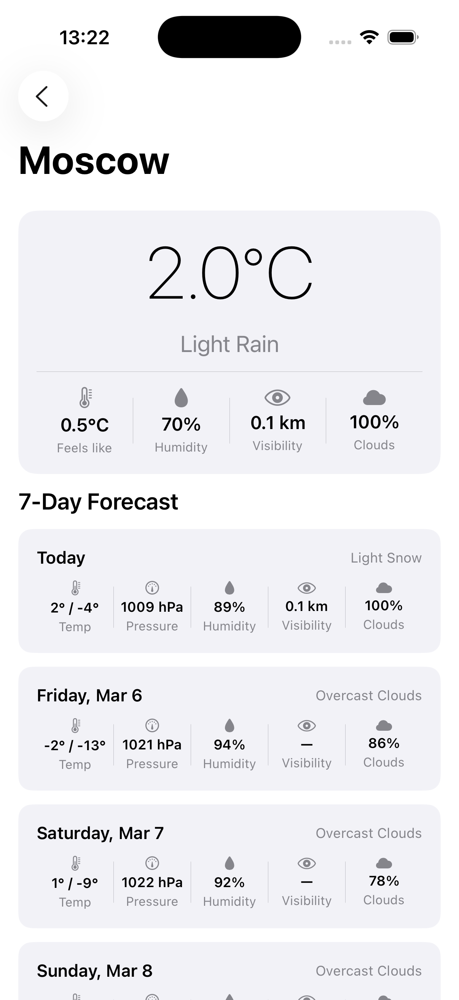

# WeatherTestApp

Test assignment for **Senior iOS Developer** position.

A SwiftUI weather application that displays current weather and a 7-day forecast for 5 world capitals, using the OpenWeatherMap API with a C++ JSON parsing bridge.

## Screenshots

| City List | City Detail |
|-----------|-------------|
|  |  |

## Features

- Displays current weather for 5 capitals: London, Paris, New York, Rome, Moscow
- Per-row refresh button for individual city updates
- Blue background highlight for cities with temperature below 10°C
- City detail screen with current conditions card: temperature, feels like, humidity, visibility, cloudiness
- 7-day forecast with daily min/max temperature, pressure, humidity, visibility, cloudiness
- All network requests run concurrently via `async let`

## Architecture

**MVVM + SwiftUI + async/await**

```
WeatherTestApp/
├── App/
│   ├── WeatherTestAppApp.swift   — App entry point
│   ├── ContentView.swift
│   └── Config.swift              — API key
├── Models/
│   ├── City.swift                — City struct + static list of capitals
│   └── WeatherModels.swift       — CurrentWeather, DailyForecast, CityWeather
├── Screens/
│   ├── CityList/
│   │   ├── CityListView.swift
│   │   ├── CityListViewModel.swift
│   │   └── CityWeatherRow.swift
│   └── CityDetail/
│       ├── CityDetailView.swift
│       └── CityDetailViewModel.swift
├── Services/
│   └── WeatherService.swift      — URLSession, async/await
├── Bridge/
│   ├── JSONParserBridge.h        — ObjC++ interface
│   ├── JSONParserBridge.mm       — C++ JSON parsing via taocpp/json
│   └── WeatherTestApp-Bridging-Header.h
└── ThirdParty/
    └── tao/                      — taocpp/json 1.0.0-beta.14 + PEGTL 3.2.7
```

## Technical Stack

| Component | Details |
|-----------|---------|
| UI | SwiftUI |
| Concurrency | Swift async/await, `async let` for parallel requests |
| Networking | URLSession |
| JSON Parsing | **taocpp/json** (C++ header-only library via ObjC++ bridge) |
| API | OpenWeatherMap `/data/2.5/weather` + `/data/2.5/forecast` |
| Architecture | MVVM |
| Minimum iOS | iOS 16 |
| Language | Swift 5 + Objective-C++ |

## C++ JSON Bridge

JSON responses are parsed in C++ using [taocpp/json](https://github.com/taocpp/json) — a header-only C++17 library. The `JSONParserBridge` (ObjC++) acts as a boundary layer between C++ and Swift:

- `parseCurrentWeatherData(_:)` — parses `/data/2.5/weather` response
- `parseForecastData(_:)` — parses `/data/2.5/forecast` response, groups 3-hour entries by calendar day, and returns daily aggregates

The `ThirdParty` directory is added to `HEADER_SEARCH_PATHS` in the Xcode project so that `#include <tao/json.hpp>` resolves correctly.

## Setup

1. Clone the repository
2. Open `WeatherTestApp.xcodeproj` in Xcode 15+
3. The API key is set in `WeatherTestApp/App/Config.swift`:
   ```swift
   enum Config {
       static let apiKey = "YOUR_API_KEY"
   }
   ```
   Replace with your own [OpenWeatherMap](https://openweathermap.org/) API key if needed.
4. Select a simulator or device and run (Cmd+R)

> No external package managers (CocoaPods, SPM, Carthage) are used. All dependencies are vendored in `ThirdParty/`.

## API Endpoints

| Endpoint | Purpose |
|----------|---------|
| `GET /data/2.5/weather?lat=&lon=&appid=&units=metric` | Current weather |
| `GET /data/2.5/forecast?lat=&lon=&appid=&units=metric` | 5-day / 3-hour forecast |

> Note: The forecast endpoint returns 3-hour intervals. The bridge groups them by UTC day and aggregates daily min/max temperature, average pressure, humidity, and cloudiness. Visibility is not included in forecast entries and is shown as "—" for future days.
